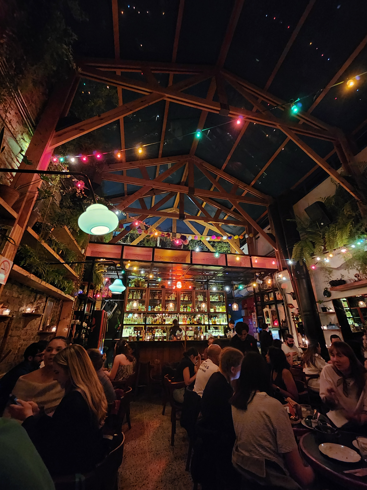
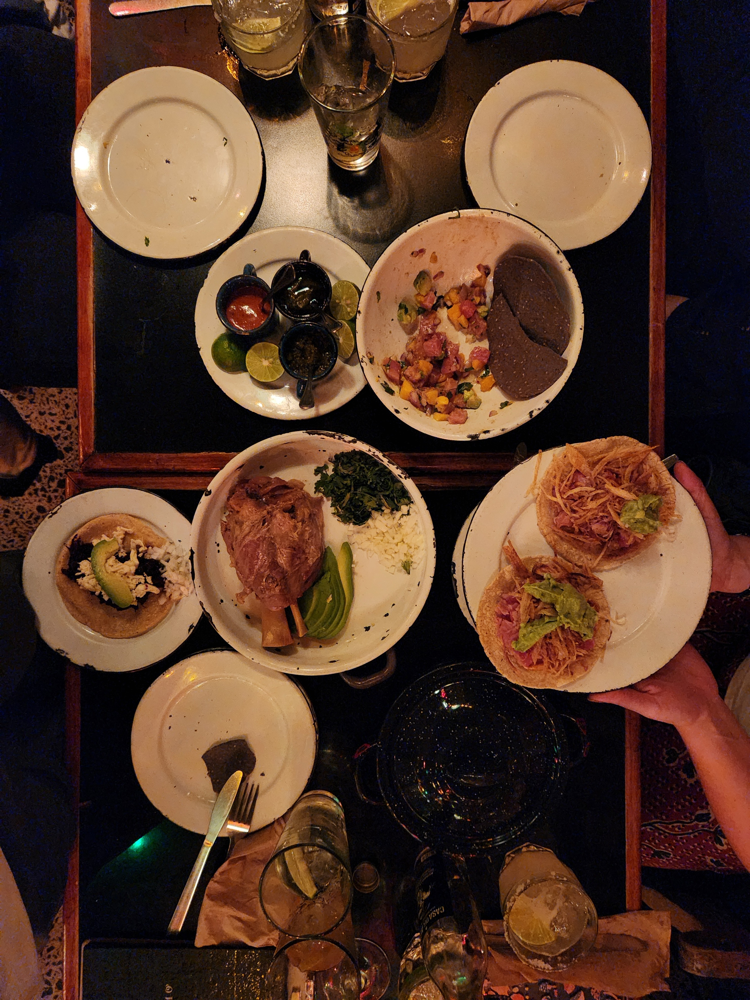

## Mexico City Musts

> This is an overview of my recent trip to Ciudad de México

### 1. Balloon ride over *Teotihuacán*
Book a hot air balloon ride with [**Flying Pictures México**](https://flyingpictures.mx/)
The 5AM wake up call is worth it!

```{r echo=FALSE, out.width="30%"}
knitr::include_graphics("photos/balloons_and_me.jpg")
knitr::include_graphics("photos/balloons.jpg")
```

### 2. Dinner at Páramo
Subtle entrance directly to a staircase under a red neon sign
Get the ceviche!
[**Google maps**](https://maps.app.goo.gl/3KfHqf8LXdGNZufs6)
[**Bon appetit guide**](https://www.bonappetit.com/city-guides/mexico-city/venue/paramo) 

```{r echo=FALSE, out.width="30%"}


```


### 3. Frida Kahlo Museum
So. Much. Blue.
[**buy tickets**](https://www.museofridakahlo.org.mx/visita/#rates)

```{r echo=FALSE, out.width="30%"}
knitr::include_graphics("photos/blue.jpg")
```

### 4. Tienda de Ropa Mercado Coyoacán
Peruse the colorful shops
Grab a bite in the market center
Then cross the street to the open air artist market (Saturdays)
[**Google maps**](https://maps.app.goo.gl/s9zKGm6ATgYaqbZW9)

```{r echo=FALSE, out.width="30%"}
knitr::include_graphics("photos/market.jpg")
```

### 5. Risk it all for a street taco
I recommend one from the ladies at [**Parque de la Ciudadela**](https://maps.app.goo.gl/1NLyoBC9tGYzXuuj7)

```{r echo=FALSE, out.width="30%"}
knitr::include_graphics("photos/tacos.jpg")
```

U+00E1	á	&#225
U+00E9	é	&#233
U+00ED	í	&#237
U+00F3	ó	&#243
U+00FA	ú	&#250
U+00F1	ñ	&#241
